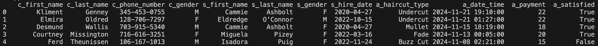
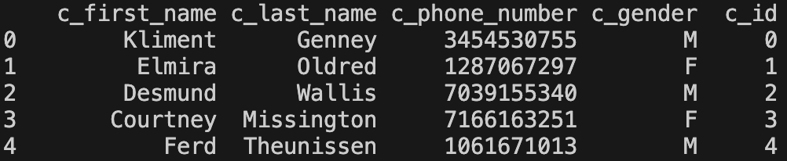
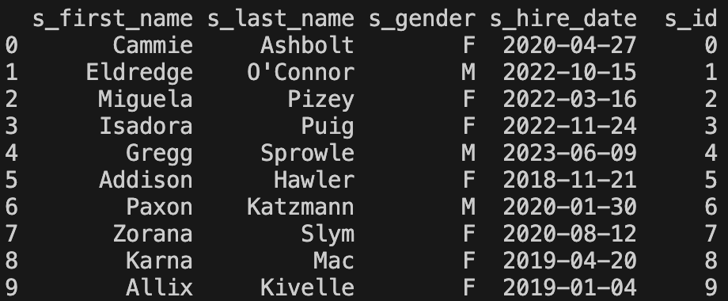
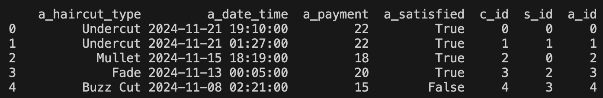

#### Project 3
# Hair Salon
- This is a group project. Through GitHub Classroom you should have created a shared GitHub repository with your group members, so as long as you upload your finished code to that group repository, each member in your team will get credit. You will also need to fill out a peer review survey on Learning Suite to recieve credit.
- I do not provide automated tests for projects. You will need to determine yourself whether the code meets the requirements provided in the rubric. After you turn in your code, a combination of autograding and manual grading will be done (meaning partial credit may be given for certain requirements). The TAs will update the `Rubric.md` file with your grade and any comments that they have.
- For this project, assume a local hair salon, Incredible Cuts, asked your team to create an app prototype for them. Up until now, they've just been recording their business data manually. They provided you a sample of that data in the `starting_hair_salon_data.xlsx` file. They want you to create a tool that lets their customers check in, as well as give managers access to important data.
- This project is split up into 4 parts in 4 different files:
    - Part 1: Creating a database and classes with peewee
        - Use the `p3_db_classes.py` file
    - Part 2: Importing data from Excel into your database
        - Use the `p3_data_import.py` file
    - Part 3: Writing a program for checking in to the hair salon
        - Use the `p3_hair_salon.py` file
    - Part 4: Writing a program for manager tools
        - Use the `p3_manager_tools.py` file
- Important: Because you'll have multiple .py files open, make sure you save all your open files before running any single file.
    - You can go to File > Save All in VS Code to do this.
    - Or, the shortcut on Mac is `cmd + opt + s`
    - Or, the shortcut on Windows is `ctrl + k` then release the keys, then press `s`
- Part 1 should be done before the others, and it will be easier to do part 3 & 4 if part 2 is done first, but you could work on parts 2, 3, and 4 simultaneously if you want to split work up among group members.

## Libraries Required:
- `peewee`
- `pandas`
- `random`
- `datetime`
    - For datetime, I recommend just using this: `from datetime import datetime`

## Part 1: Creating a database and classes with peewee
- Write all your code for part 1 in the `p3_db_classes.py` file
- Using `peewee`, create an SQLite database called `hair_salon.db`. Make sure you store the `SqliteDatabase` object in a variable.
- Your database should contain 3 tables: `Customer`, `Stylist`, and `Appointment`, meaning you need to create 3 classes with the same name that inherit from the `peewee` class `Model`.
- Eventually, in Part 2 of the project, you are going to fill the database with data from the provided Excel file. Part 2 will be much easier if you keep the column names consistent in your classes and what you call them when you import them in Part 2. Suggested column names are provided below, but you could technically rename them. Do whatever you find easiest.
- `Customer` Class fields:
    - `c_id`: AutoField, should also be a primary key
    - `c_first_name`: CharField
    - `c_last_name`: CharField
    - `c_phone_number`: CharField or IntegerField
    - `c_gender`: CharField
- `Stylist` Class fields:
    - `s_id`: AutoField, should also be a primary key
    - `s_first_name`: CharField
    - `s_last_name`: CharField
    - `s_hire_date`: DateField
    - `s_gender`: CharField
- `Appointment` Class fields:
    - `a_id`: AutoField, should also be a primary key
    - `a_haircut_type`: CharField
    - `a_date_time`: DateTimeField
    - `a_payment`: FloatField
    - `a_satisfied`: BooleanField
    - `c_id`: ForeignKeyField, needs to reference `Customer`, call the backreference 'appointments'. set on_delete to be 'CASCADE'
    - `s_id`: ForeignKeyField, needs to reference `Stylist`, call the backreference 'appointments'. set on_delete to be 'CASCADE'
- Write a function (not part of any class) called `initialize_database`.
    - The function doesn't need to accept any parameters. You can just reference the global variable that your `SqliteDatabase` object is stored in (the one you create above your Classes).
    - The function should run the `.connect()` method on your `SqliteDatabase` object.
    - Then, the function should run the .`create_tables()` method on you `SqliteDatabase` object and create your `Customer`, `Stylist`, and `Appointment` tables.
    - Your function should then return the `SqliteDatabase` object.
    - You'll call this function in all of the other python files you make in the project, so that you have access to the database each time
- Optional, but recommended:
    - You can also write a function called `start_from_scratch()` that deletes all the tables in your database. I'd recommend writing this just so that in part 2 as you are testing your code you don't have to manually delete your database as you are getting it to work. It also will prevent you from inserting in duplicate data if you run your code multiple times. I'll give you the code here. This assumes you called your `SqliteDatabase` object `db`.:
    - ```
      def start_from_scratch():
          """
          Drops specified tables ('appointment', 'stylist', 'customer') in the SQLite database if they exist.
          """
          tables_to_drop = ['appointment', 'stylist', 'customer']
          db.connect()
    
          with db.atomic():
              for table in tables_to_drop:
                  db.execute_sql(f"DROP TABLE IF EXISTS {table};")
                  print(f"Dropped table: {table}")
          db.close()
      ```
## Part 2: Importing data from Excel into your database
- Note: Read this whole section before starting to code. I give you very specific hints at the bottom of this section.
- Write all your code for part 2 in the `p3_data_import.py` file.
- Start by importing the `starting_hair_salon_data.xlsx` file into a pandas DataFrame. This is a representation of the data that Incredible Cuts is giving you to start out with. If you were to print out this DataFrame, the first 5 rows would look like this:
    - 
- If you look through the Excel file, you'll notice that each row represents an appointment, but that we are repeating customer and stylist info mutliple times each time they have an appointment. That is a waste of memory, and is prone to errors when entering data.
- Your job is to separate out this DataFrame into 3 different DataFrames: one for Customers, one for Stylists, and one for Appointments. This is called "normalizing".
    - You'll notice that each column name is prefaced by `c_`, `s_`, or `a_`. The `c_` columns all need to end up in the `Customer` table, `s_` columns need to end up in the `Stylist` table, and `a_` columns need to end up in the `Appointment` table.
    - Once you have 3 separate DataFrames, you'll store the data in the appropriate tables of your database using the `.to_sql()` method.
- You also need to do some small "data cleaning" of the c_phone_number column to get rid of the dashes.
    - So, for example `345-453-0755` should become `3454530755`.
- Here are examples of what each DataFrame should look like. How you get to this end result is entirely up to you, but below are some hints about one way you might do it.
- **Customers DataFrame**:
    - It should have 368 rows when duplicates are removed. Notice the creation of a column called `c_id`. You can call this whatever you want, but your database will need a column for a primary key field to uniquely identify customers.
    - 
- **Stylist DataFrame**:
    - It should have 9 rows when duplicates are removed. Notice the creation of a column called `s_id`. You can call this whatever you want, but your database will need a column for a primary key field to uniquely identify stylists.
    - 
- **Appointment DataFrame**:
    - It should have 1000 rows (no duplicates need to be removed). Notice the creation of a column called `a_id`, as well as the presence of `c_id` and `s_id`. Each appointment needs a unique id `a_id`, and also foreign keys for Customer `c_id` and Stylist `s_id` that corresponds to the primary keys of Customer and Stylist.
    - `
- Once you have your 3 separate DataFrames, use the `start_from_scratch()` function (if you wrote it) and then the `initialize_databas()` function from your `db_classes.py` file to get a `SqliteDatabase` object. Use that object when you call `.to_sql()` on each of your 3 DataFrames so that you can insert the data into your database.
####  VERY SPECIFIC HINTS FOR PART 2 (one possible logical flow, e.g. the way Prof. Steffen might do it):
- Import the original Excel file as a DataFrame (I refer to it as `combined_df` in the steps below)
- Make the Customer DataFrame:
    - First, get the unique columns for just customers and store it in a new DataFrame:
        `c_df = combined_df[['c_first_name', 'c_last_name', 'c_phone_number', 'c_gender']].copy()`
    - Then, run the `.drop_duplicates()` method on your new DataFrame to get rid of duplicates.
    - Then, run the `.reset_index(drop=True)` method on your new DataFrame to reset your index starting from 0 (technically, this isn't needed, but I think it is nice to start your id from zero)
    - Then, make a new column in your DataFrame equal to the index, so that you have a specific primary key column
        `c_df['c_id'] = c_df.index`
- Make the Stylist DataFrame 
    - Repeat the same thing as above, but for the Stylists using the `s_` columns from the original DataFrame.
- Make the Appointment DataFrame
    - The trick here is that you need to not only grab the `a_` columns, but you also need to insert in new columns for the foreign keys of Customer and Stylist. The easiest way to do this is to use the `.merge()` method. I never showed you this in class, so I'm just going to give you an example below.
        - The idea is that we are creating a new dataframe from two separate DataFrames wherever there is a match between the first name, last name, etc of the Customers and bringing along all the extra columns that the original DataFrame doesn't have (like the new `c_id` or `s_id` columns). Then I just drop all the other columns I don't need until there is only `a_` columns and the foreign keys.
    - ```
        # combine the original df and the c_df to add the new c_id column
        a_df = combined_df.merge(c_df, on=['c_first_name', 'c_last_name', 'c_phone_number', 'c_gender'])

        # now combine the new a_df with the stylist df to put the s_id column into it
        a_df = a_df.merge(s_df, on=['s_first_name', 's_last_name', 's_gender', 's_hire_date'])

        # now get rid of c_ and s_ columns except for the s_id and c_id foreign keys
        a_df.drop(['c_first_name', 'c_last_name', 'c_phone_number', 'c_gender', 's_first_name', 's_last_name', 's_hire_date', 's_gender'], axis=1, inplace=True)

        # create a primary key column for appointments
        a_df["a_id"] = a_df.index
        ```
- Clean up the phone numbers in the Customer dataframe
    - The easiest way to do this is just using the str function `.replace()`.
    - Here's an example of replacing 'M' with 'Male' in the `c_gender` column. Don't actually do this, just try and see how you could apply this logic to the `c_phone_number` column to get rid of the `-`s in the column.
        - `c_df['c_gender'] = c_df['c_gender'].str.replace("M", "Male")`
- Export your data to your SQLite database
    - Using the connected SqliteDatabase object from your `initialize_database()` function (which I just call `db`), send your DataFrame data to your database. Make sure you send the Customer and Stylist data first before the Appointment data (since the primary keys need exist before the foreign keys)
    - ```
      c_df.to_sql('customer', db, if_exists='append', index=False)
      s_df.to_sql('stylist', db, if_exists='append', index=False)
      a_df.to_sql('appointment', db, if_exists='append', index=False)
      ```
    - Running the above code will likely give you this warning in the terminal:
        - `UserWarning: pandas only supports SQLAlchemy connectable (engine/connection) or database string URI or sqlite3 DBAPI2 connection. Other DBAPI2 objects are not tested. Please consider using SQLAlchemy.`
        - You can just ignore this. Peewee isn't officially tested with Pandas, but it works just fine so you can safely ignore the warning.

## Part 3: Check In Process
- The point of this file is to simulate the check in process for a customer as a they walk in to the hair salon. Customers will enter in their phone number to check in. If the phone number is in the database, they are recognized as a returning customer and can choose to use their previously stored data. Otherwise, they are a new customer and more info will be gathered about them.
- Write all your code for part 3 in the `p3_check_in.py` file.
- This file should import `initialize_database, Customer, Stylist, Appointment` from your `p3_db_classes.py` file. 
1. Ask user to enter in a 10-digit phone number:
    - `Hello! Welcome to Incredible Cuts. Please enter your phone number to check in: `
    - Note: To make this easier to test, I included a customer with 3 appointments that has the phone number `1234567890`
    - You should check whether the input is a valid 10 digit phone number, and it should be able to handle any spaces <code>&nbsp;</code> or any dashes `-` inside the input. 
    - To simplify the project, you can assume that no user will ever enter any other invalid characters (like `asdf 123-456-asdf-7890!!`), though feel free to add logic to handle those cases too if you want extra optional practice.
    - For example, these 3 examples should all be considered valid:
        - `1234567890`
        - `123 456 7890`
        - `123-456-7890`
     - > **Hint**: Here are 3 potential ways you might check the input:
        > -  Use `.replace()` multiple times to get rid of spaces and dashes.
        > - Try and convert each character of the input to an `int()`. Only keep the characters that are capable of becoming ints.
        > - Check whether `.isdigit()` returns `True` for each character of the input, and only keep those characters.
    - Any input that doesn't include 10 digits should be rejected, and you should ask the user to reinput the number.
        - For example, if the user enters something like this:
            - `123`
        - It should print out:
            `That wasn't a 10 digit phone number. Please try again.`
        - Any then ask again until a valid 10 digit number is provided.

2. If phone number is in the database, get that customer as an object
    - If the phone number corresponds to an existing customer in the database, retrieve that customer as a `Customer` object. Otherwise, you'll create a new customer object (described in section 3)
    - Call the method `returning_customer_message()`, which is method you should write in the `Customer` class in `p3_db_classes.py`
        - `returning_customer_message()` should print out:
            - `Welcome! You've had <number of appointments> appointments with us!`
        - If they've had no appointments, then the function should just end there and return `None` (which happens automatically if there's no return statement)
        - But, it they've had at least 1 appointment, get the data from their most recent appointment and print this out:
            - `At your last haircut on <appointment date time> you got a <haircut type> haircut with <stylist first name> as your stylist.`
            - Your method should return an appointment object of their most recent appointment.
    - If `returning_customer_message()` returned an `Appointment` object, then ask:
        - `Do you want to continue with these same options? Enter 'Y' if so, otherwise enter 'N': `
        - If they enter `Y`, then use the same haircut_type and stylist when you create the `Appointment` in step 5.
    - If either `returning_customer_message()` doeesn't return an `Appointment` object, or the user enters `N` (or anything other than `Y`) when asked about continueing with the previous options, then just proceed to choosing a hairstyle and stylist in step 4.

3. If phone number isn't in the database, create a new customer
    - If the phone number isn't already in the database, then do the following:
        - print `Thanks for joining us! Enter the following information:`
        - Get a first name: `Enter your first name: `
        - Get a last name: `Enter your last name: `
        - Get their gender: `Enter your gender (M or F): `
    - Then using that information and the phone number originally entered, create a new customer in the database, and store the customer object in a variable.

4. Choose a hairstyle and stylist
    - New customers, or returning customers that didn't respond `Y` to using their previous choices, need to choose a hairstyle and stylist.
    - First, choose a hairstyle
        - You can use the included dictionary's keys as the choices for hairstyle
            - ```
              hairstyles_dict = {
                "Undercut": 22.0,
                "Mullet": 18.0,
                "Fade":	20.0,
                "Buzz Cut":	15.0,
                "Pixie Cut": 30.0,
                "Bob": 28.0,
                "Pompadour": 40.0,
                "Layered Cut": 25.0,
                "Crew Cut": 16.0,
                "Shag": 35.0
              }
              ```
        - Ask the user to enter the number of hairstyle they want:
            - ```
              These are the available hairstyles: 
              1: Undercut
              2: Mullet
              3: Fade
              4: Buzz Cut
              5: Pixie Cut
              6: Bob
              7: Pompadour
              8: Layered Cut
              9: Crew Cut
              10: Shag
              Enter the number of the hairstyle you want:
              ```
            - To simplify the project, you can assume that the user will always enter a valid number of hairstyle.
    - 2nd, choose an option for selecting a stylist:
        - `To get the first available stylist regardless of gender, enter 1. If you want your stylist to be the same gender as you, enter 2: `
        - To simplify the project, assume the user will always enter either 1 or 2.
        - Remember that you can get all Stylists by using `Stylist.select()`. You might find that easier to work with if you convert that to a list by using `list(Stylist.select())`
        - If they enter `1`, just grab a random Stylist.
        - If they enter `2`, grab a random Stylist, but make sure that the gender of the stylist matches the gender of the Customer.
5. Create an `Appointment`
    - print a message that the haircut was performed:
        - `<stylist first name> <stylist last name> gave you a <hairstyle> haircut today!`
    - Ask whether they were satisfied. If they enter `Y`, store it as a `True` boolean value, otherwise `False`
        - `Are you satisfied? Enter Y or N: `
    - Create an `Appointment` entry in the database using the `Appointment` class you already made in your `p3_db_classes.py` file.
        - for `a_date_time`, set it equal to `datetime.today()`
        - `a_haircut_type` should be a string of the hairstyle they chose.
        - `a_payment` should be how much the haircut cost. See the included dictionary for what the price should be for each hairstyle.
        - `a_satisfied` should be a `True` or `False` boolean.
        - `c_id` should be a customer object
        - `s_id` should be a stylist object.
    - It should then print out:
        - `Thank you for choosing Incredible Cuts! We hope to see you again soon.`
        - The program can then end.

## Part 4: Manager Tools
- The point of this file is to simulate a few of the capabilities and reports that a manager of the hair salon might want access to.
- Write all your code for part 4 in the `p3_manager_tools.py` file.
- Print out the following:
    - ```
      Welcome to Manager Tools. Choose an option below: 
      1. See the 5 most recent appointments that weren't satisfied
      2. Delete a stylist from the database
      3. Exit
      Enter an option: 
      ```
    - Repeatedly print out this menu after an option is chosen, until the user enters `3` to exit. If they enter an invalid choice, just print out `Invalid selection. Try Again.`
- Option 1:
    - If the user enters `1`, then get the 5 most recent appointments where the `a_satisfied` is equal to `False`.
    - Run a method called `get_appointment_info()` on each `Appointment` object that you get and print the result.
        - Put `get_appointment_info()` in the `Appointment` class as a method.
        - If the appointment's `a_satisfied` is `True` then return:
            - `Appointment <appointment id> on <date time>: <customer first name> <customer last name> got a <haircut type> from <stylist first name> <stylist last name>. <customer first name> was satisified.`.
        - If the appointemnt's `a_satisfied` is `False` then return (identical except for the very end):
            - `Appointment <appointment id> on <date time>: <customer first name> <customer last name> got a <haircut type> from <stylist first name> <stylist last name>. <customer first name> was not satisified.`
- Option 2:
    - If the user enters `2`, then it should display the id, first name, and last name of all the Stylists and ask for an ID to enter. If no other Stylists have been deleted (or added), it will probably look like this:
        - ```
          0: Cammie Ashbolt
          1: Eldredge O'Connor
          2: Miguela Pizey
          3: Isadora Puig
          4: Gregg Sprowle
          5: Addison Hawler
          6: Paxon Katzmann
          7: Zorana Slym
          8: Karna Mac
          9: Allix Kivelle
          Enter the ID of a stylist to delete: 
          ```
        - To simplify the project, you can assume that a proper ID will always be provided.
    - After the user enters an ID, it should delete that Stylist from the datababse and then print a message:
        - `<stylist first name> <stylist last name> was deleted from the database.`
    - If you are running into errors when doing this, make sure your `Appointment` class `s_id` variable has `on_delete='CASCADE'` listed in the parentheses of the `ForeignKeyField()`
- Option 3:
    - If the user enters `3`, print out:
        - `Thank you for using the program.`
    - Then the program should end.
- Extra challenges:
    - If you want some extra challenges for no extra points, you could try doing more reports for managers, such as:
        - See which stylists have brought in the most money
        - See which stylists have the highest satisfaction
        - See which hair cut styles have brought in the most money.
    - To do any of the above, you probably need to be familiar with using group by, which you can do in peewee, pandas, or raw SQL.

## Grading Rubric
See `Rubric.md`

## Example Output

### Part 1: p3_db_classes.py
Nothing needs to print out here

### Part 2: p3_data_import.py
Nothing needs to print out here, though you could print out the pandas DataFrames if you want.
This file should populate your database with data.

### Part 3: p3_check_in.py

Here is a returning customer choosing to use the same hair cut and stylist as before:

```
Hello! Welcome to Incredible Cuts. Please enter your phone number to check in: 1234567890
Welcome! You've had 3 appointments with us!
At your last haircut on 2024-11-21 19:10:00 you got a Undercut haircut with Cammie as your stylist.
Do you want to continue with these same options? Enter 'Y' if so, otherwise enter 'N': Y
Cammie Ashbolt gave you a Undercut haircut today!
Are you satisfied? Enter Y or N: Y

Thank you for choosing Incredible Cuts! We hope to see you again soon.
```

Here is a returning customer choosing to enter in a new hair cut and stylist. Notice that Using dashes with the phone number works just fine:
```
Hello! Welcome to Incredible Cuts. Please enter your phone number to check in: 123-456-7890
Welcome! You've had 4 appointments with us!
At your last haircut on 2024-12-07 01:58:09.617900 you got a Undercut haircut with Cammie as your stylist.
Do you want to continue with these same options? Enter 'Y' if so, otherwise enter 'N': N
These are the available hairstyles: 
1: Undercut
2: Mullet
3: Fade
4: Buzz Cut
5: Pixie Cut
6: Bob
7: Pompadour
8: Layered Cut
9: Crew Cut
10: Shag
Enter the number of the hairstyle you want: 4
To get the first available stylist regardless of gender, enter 1. If you want your stylist to be the same gender as you, enter 2: 2
Eldredge O'Connor gave you a Buzz Cut haircut today!
Are you satisfied? Enter Y or N: N

Thank you for choosing Incredible Cuts! We hope to see you again soon.
```

Here is a new customer with a phone number not recognized in the database:

```
Hello! Welcome to Incredible Cuts. Please enter your phone number to check in: 0987654321

Thanks for joining us! Enter the following information:
Enter your first name: Jimmy
Enter your last name: John
Enter your gender (M or F): M
These are the available hairstyles: 
1: Undercut
2: Mullet
3: Fade
4: Buzz Cut
5: Pixie Cut
6: Bob
7: Pompadour
8: Layered Cut
9: Crew Cut
10: Shag
Enter the number of the hairstyle you want: 9
To get the first available stylist regardless of gender, enter 1. If you want your stylist to be the same gender as you, enter 2: 1

Allix Kivelle gave you a Crew Cut haircut today!
Are you satisfied? Enter Y or N: Y

Thank you for choosing Incredible Cuts! We hope to see you again soon.
```

### Part 4: p3_manager_tools.py

Here's an example of choosing all 3 options:

```
Welcome to Manager Tools. Choose an option below: 
1. See the 5 most recent appointments that weren't satisfied
2. Delete a stylist from the database
3. Exit
Enter an option: 1

Appointment 1001 on 2024-12-07 01:59:05.786888: Kliment Genney got a Buzz Cut from Eldredge O'Connor. Kliment was not satisified.
Appointment 4 on 2024-11-08 02:21:00: Ferd Theunissen got a Buzz Cut from Isadora Puig. Ferd was not satisified.
Appointment 9 on 2024-10-31 19:26:00: Horacio Morpeth got a Fade from Zorana Slym. Horacio was not satisified.
Appointment 12 on 2024-10-27 19:30:00: Etheline Latimer got a Pixie Cut from Paxon Katzmann. Etheline was not satisified.
Appointment 13 on 2024-10-27 01:32:00: Beatriz Timmis got a Pompadour from Cammie Ashbolt. Beatriz was not satisified.

Welcome to Manager Tools. Choose an option below: 
1. See the 5 most recent appointments that weren't satisfied
2. Delete a stylist from the database
3. Exit
Enter an option: 2
0: Cammie Ashbolt
1: Eldredge O'Connor
2: Miguela Pizey
3: Isadora Puig
4: Gregg Sprowle
5: Addison Hawler
6: Paxon Katzmann
7: Zorana Slym
8: Karna Mac
9: Allix Kivelle

Enter the ID of a stylist to delete: 9
Allix Kivelle was deleted from the database.

Welcome to Manager Tools. Choose an option below: 
1. See the 5 most recent appointments that weren't satisfied
2. Delete a stylist from the database
3. Exit
Enter an option: 3
Thank you for using the program.
```
